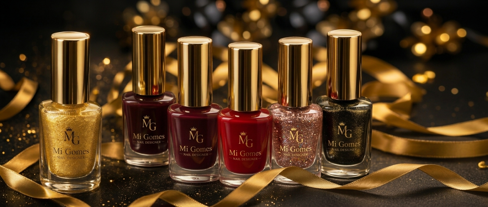

# Mi Gomes Nail Designer

✨ Sobre o projeto

O projeto foi desenvolvido com foco em experiência do usuário (UX) e design responsivo, utilizando uma identidade visual baseada em tons escuros e detalhes dourados para transmitir uma sensação de luxo, beleza e sofisticação.

Landing page responsiva para uma nail designer, com apresentação de serviços, galeria de trabalhos e contato para agendamento via WhatsApp.

Construída com **Next.js**, **React**, **TypeScript** e **Tailwind CSS**.

## Executar localmente

```bash
npm install
npm run dev
```

Acesse [http://localhost:3000](http://localhost:3000).

## Scripts

```bash
npm run dev      # inicia o desenvolvimento
npm run lint     # verifica o código
npm run build    # gera a versão de produção
npm start        # inicia a versão de produção
```

## Preview



## Autoria

**Juliana Mininel** · Frontend Developer
